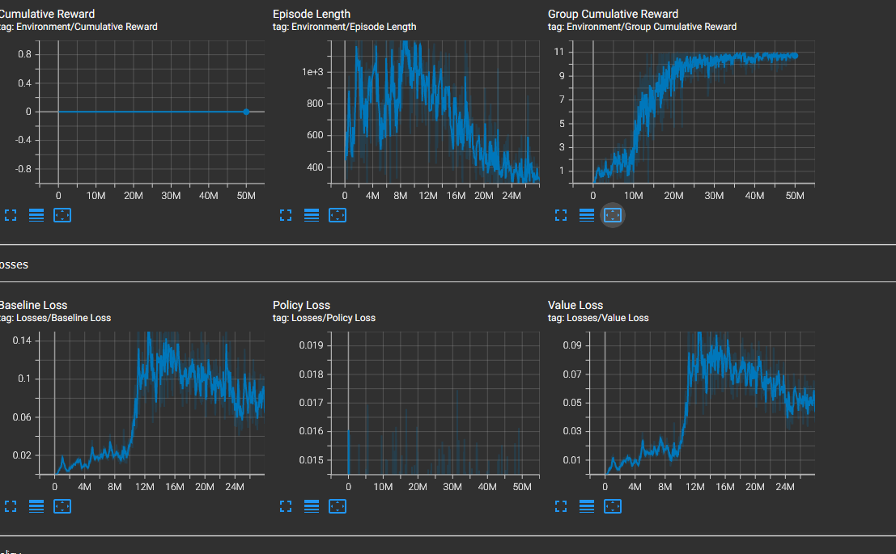

# Unity ML Agent: Prisoner Break out

A review of Unity ML Agents to train Agents work with highly collaborative behaviours. The objective is for the two Prisoner agents to work together to develop an escape plan. (c.f. The previous DuffBall experiment, https://github.com/JulesVerny/DuffBallML could acheive goal success with little team player collaboration). The intention of this experiement is to explicitly require collaborative actions for success between two ML Agents.   

Please see the results of the Trained Prisoners Agents execute a reasonable esacpe plan sequence on You Tube at << Your Tube Link   >> 

### Break out Overview 

The Environment consists of two Prisoner Agents.  The Agents can be pursuaded to execute an escape sequence through the use of a reward objective sequence: Moving a Crate, Jumping and Climbing onto the Crate, Jumping and Climbing onto the Wall, and then move towards an exit gate. The jumping and climbing actions require the Prisoner Agents to collaborate and synchronise their actions together.  One Prisoner has to Kneel down, to enable the other to jump up onto the next level. And once on the next level, a prisoner hs to kneel down, to pull up the otehr Prisoner that is Climbing up.     

The Prisoner Agent is encoded to be in one of the following states: { StandingIdle, Walking, PushingCrate, KneelingDown, JumpingUp, PullingUpCollegue, ClimbingUp }

The Prisoner Agents have possible Actions:    { None, RotateLeft, RotateRight, WalkForward, PushCrate, KneelDown, StandUpIdle, JumpUp, ClimbUp, PullUp }

These Actions are Masked, such that they cannot PushCrate, if the Prisoner is not in the proximatory to the Crate. Neither can the JumpUp and ClimbUp actions be accomplished unless the Prisoner, and the Co Prisoner are in compatible states. In order to Jump Up onto the crate or Wall, the other Prisoner needs to kneeling in front, on the ground or on the crate to support the jump. And in order to climb up the co prisoner needs to to be above, either on the crate or on the wall to help pull the prisoner up.  

The scenario is based upon the use of significant number of spatial and state checks, which affects what prisoners are allowed to perform. These are reflected within the Observations space, to help influence the Agent training. 
 
### Observation Space 
The Observation Space consists of:

3D Spatial Awareness:
- 3D Ray Sensor at the Prisoner Hip level, to detect (Crate, Co-Prisoner, Walls and Exit Gate) on the same level as the Prisoner) on same spatial level as prisoner
- 3D Ray Sensor above the Prisoner to detect (Crate, Co-Prisoner, Walls and Exit Gate) on the spatial level above the Prisoner

5x Explicit Spatial Awareness:
- X Local Position
- Z Local Position
- Y Local Rotation  (c.f. Prisoner heading)
- Crate.X Local Position relative to Wall
- crate.z Local Position
Where +x is Forwards towrads the Wall and The Exit Gate from the Originla Positions  and Z is depth side to side wrt to the Wall and Crate. +y is Up

7x Proximal Spatial and State Check Observations
- bool: PrisonersAreFacingEachOther()
- bool: InProximatoryToCoPrisoner()
- bool: IsFacingFoward()
- bool: IsOnLowerFloor()
- bool: IsOnTheCrate()
- bool: IsOnTheUpperLevel()
- bool: IsWithinCratePushingZone() 

6 x Hot encoded Player State: (Walking, PushingCrate, KneelingDown, JumpingUp, PullingUpCollegue, ClimbingUp)

6 x Action Conditionals:
- bool: WalkingIsPossible()
- bool: RotatingIsPossible()
- bool: PushingIsPossible()
- bool: KneelingIsPossible()
- bool: JumpingIsPossible()
- bool: ClimbingIsPossible()

### Extensive Reward Shaping

Collaborative Unity Group Training is employed, with the rewards are Allocated to the Prisoner Group.  The ExperimentControl.cs script manages the registration of both Prisoners into the Group via RegisterAgent() and the assignment of Group Rewards calls.  

A Significant amount of Reward Shaping is required to get any Agent Discovery, Exploitation to make any Progress in this scenario. It being extremely unlikely that the Agents would discover the means to capture overall Objective of both reaching the Exit Gate, from their initial positions in a single Objective/Reward phase. A number of collaborative steps required to get anywhere. So the scenario has been partitioned into Sub Objectives, with Partial rewards Assigned to help Agent Training through the sequence: 

| Level |Level Objective                    | Reward   |
|:-----:|:---------------------------------:|:------:|
| 1  | Both Prisoners At Crate | 0.2|
| 2  | Both Prisoners Pushing | 0.4|
| 3  | Pushed To Crate the Wall | 1.4|
| 4  | Prisoner Kneeling At Crate | 1.6|
| 5  | Prisoner Able to Jump Onto Crate | 1.8|
| 6  | A Prisoners On the Crate | 2.0|
| 7  | Prisoner Kneeling At Crate | 2.2|
| 8  | Prisoner Able to Climb Onto Crate | 2.4|
| 9  | Both Prisoners On the Crate | 2.6|
| 10  | Prisoner Kneeling On Crate | 2.8|
| 11  | Prisoner Able to Jump Onto Wall | 3.0|
| 12  | A Prisoner On the Upper Level | 3.2|
| 13  | Prisoner Kneeling On Wall | 3.4|
| 14  | Prisoner Able to Climb Onto Wall| 3.6|
| 15  | Both Prisoners On Upper level | 3.8|
| 16  | Both Prisoners Facing Exit Gate  | 4.0|
| 17  | Both Prisoners Escaped | 5.0|
| 18  | Both Prisoners Escaped (Perpetual) | 5.0|

Th ExperimentControl.cs progresses the Training through the Levels. The Ageng has to achieve 10 consecutive successfull objectives ina row, in order to be promoted to the next level. If the Episode times out, then the promotion count is decremented. And if there are more than 50 Level Objective failures, the Level will be demoted to a lower Training Level.   

The WallBreakout.yml configuration is set up to use the Unity ML POCA Multi-Agent POsthumous Credit Assignment (MA-POCA)  algorithm, which I believe is based around PPO. 

The rest of the environment is a lot of Prisoner statement management and animation control stuff, with the players transisting through their own states machines. 

The Prisoner Arena, Prisoners and Crate Game Objects are all captured within a BOEnvironment Unity Prefab Asset. So any changes to the Agents should be done within this Prefab. This Prefab is then used as a basis for replicating 12x Break Out Environment Game Objects within the Training Scene, to speed up Training. 

### Training Experience and Hyper Parameter Tuning

The Esential POCA Configuration requries a significant Time Horizon and a High Gamma, to ensure a long Trajectory of State,Action,Reward are considered in the Advanatge calculation. Large Batch Size and Buffer sizes are also required.  So Policy collapses were experienced, and so epsilon was reduced to 0.1, to clip more severely changes in policy and the learning rate down to a very conservative 0.00001, for smoother more robust, but slow, training. So the essential Configuration:      

 - batch_size: 4096
 - buffer_size:  40960
 - learning_rate: 0.0001
 - beta: 0.005
 - epsilon: 0.1
 - hidden_units: 512
 - num_layers: 2
 - gamma: 0.997
 - time_horizon: 512
 
The following Tensorboard Grapth illustrates the Group Reward Progress on a very long 50 Million Training Step Run. The first level 17 "Prisoners breakout actually occurs around 10 Million steps. The extended perpetual Level 18 Training, is to reinforce, and improve the Agnets performance over the reamining 409 Million Steps. this can be seen in the steady and asymptopic growth of the Group Reward signal. 

## Conclusions

See the eventual Trained Prisoners Escape  on You Tube at  <<  You Tube Ref  >>

- The Eventual Prisoner Trained Performance is a success rate in excess of 8 attempts out of 10. 

- This experiment would be better classed as Reinforcement Training, rather than  Machine Learning. A Significant amount of Reward Shaping and Sub Objectives were required to get the Agents any where near discovering and advancing through this prisoner escape scenario.
- As such it really only represents a reward encoding of an apriori sequence. Instead the level of Reward and Objective Shaping effort could well have been better applied to similar level of programmed logic. The consequence being a more robust, deterministic and efficient solution.
- The Agents did however discover and exploit some weaknesses in the original environment. Demonstrating some originalilty and deviousness. (These exploits have now been removed, for a more robust, and obvious, 'intended' breakout sequence)    
- This Experiment exposes the limits of Unity ML Agents, and Reinforcement Learning, in such tight collaborative  conditionally sequenced environments. 

Happy for Any Discusssion, Comments and Improvements.

## Download and Use

This project has been exported as a Unity Package into the Unity WallBreakout folder containing the Breakout Scene, Scripts, Models etc. I am not so familiar with Unity Package export/ imports, so hopefully this is the most convenient way to import the scenae and experiment into a Unity Project.   The Unity Package can be downladed and imported into Unity, or possibly via the Unity Git import directly by reference to the .json file from the Unity Package Manager.  You will also need to import the Unity ML Agents run time package (Note this project was developed and Tested using Unity ML Agents Release 19)

The Trained Brains .onxx files for the eventual Prisoner ML Agents are in the Brains Folder. These can be copied into the ML Agents behaviour components to observe the trained behaviours. 

## Acknowledgements  

- Unity ML Agents at:  https://github.com/Unity-Technologies/ml-agents
- Jason Weimann: Unity and Game Development: https://www.youtube.com/c/Unity3dCollege
- Immersive Limit: Unity Machine Learning Agents: https://www.youtube.com/c/ImmersiveLimit
- Imphenzia:  3D Blender Modelling : https://www.youtube.com/c/Imphenzia
